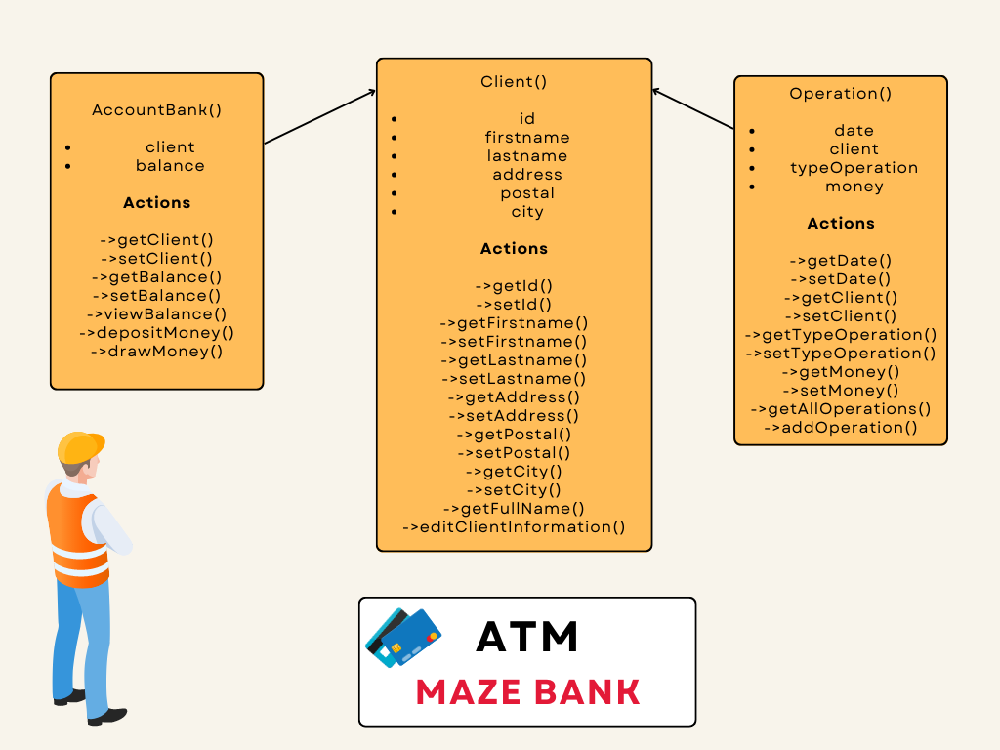

## Maze Bank - Java

```
Contexte : Creez un programme console java qui permet de simuler l'interaction avec un ATM (Distributeur Automatique de Billets).
Pour cela, il est conseille de creer un diagramme de classe UML avant de commencer a coder.
Il devra figurer dans le depot git. Il devra presenter le nom des classes, les attributs et les methodes. Ainsi que les eventuels liens entre les classes.

L'ATM devra permettre de gerer les comptes bancaires des clients.
Il devra permettre de creer un compte bancaire, de consulter le solde, de deposer de l'argent, de retirer de l'argent, de consulter l'historique des operations.

L'ATM devra permettre de gerer son compte client. Il devra permettre de modifier les infos du client (nom, prenom, adresse, code postal, ville).

Afin d'eviter que votre programme ne s'arrete pensez a configurer un menu qui permettra de choisir les actions a effectuer. On maintient ainsi le programme en vie tant que l'utilisateur ne decide pas de le quitter. Utilisez une boucle while pour cela.
```

Pour ce TP, j'ai commencé par faire mon diagramme UML.



Ensuite, j'ai créer mes classes Client, AccountBank puis Operation en dernier.
J'ai utilisé un switch case pour créer mon menu, avec une boucle do while pour créer un menu qui ne s'arrête pas tant que l'user ne donne pas le choix 6.

J'ai ensuite, relier le compte en banque à un utilisateur. 
J'ai créer la classe opération pour stocker toutes les opérations de l'utilisateur en question.

J'ai eu le temps de stocker mes utilisateurs en base de donnée, ainsi que les opérations. J'ai utilisé un id unique pour chaque utilisateur.
J'aurais aimé faire un système de connexion mais manque de temps.

Lorsque l'utilisateur modifie ses informations, ça se met également à jour en base de donnée.
(Pour la base de donnée, je me suis aidé sur YouTube pour la configuration)

**ATTENTION** : N'oubliez pas de modifier les informations de connexion en bd dans la classe Database.

Bonne expérience le JAVA contrairement à ce que je pensais.